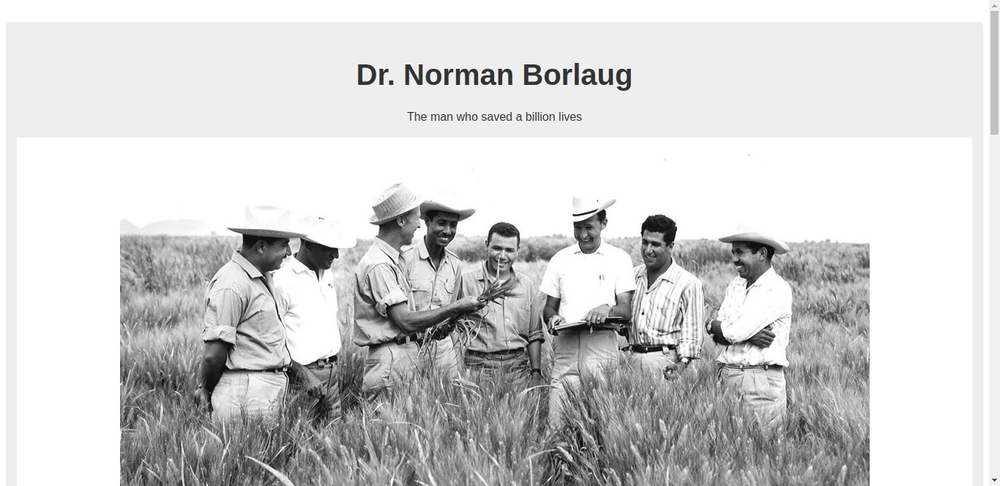

# FreeCodeCamp Tribute Page project

this is a solution to the Tribute Page project on [freecodecamp](https://www.freecodecamp.org/learn/2022/responsive-web-design/build-a-tribute-page-project/build-a-tribute-page)

## Table of content

- [overview](#overview)
  - [thechallenge](#challenge)
  - [screenshot](#sreenshot)
- [theprocess](#theprocess)
  - [built-with](#code)
- [Author](#author)

## overview

### challenge

Build an app that is functionally similar to https://tribute-page.freecodecamp.rocks/

### screenshot

## theprocess

### code

this project built with:

- HTML.
- CSS.

## Author

- linkedIn - [Abdalla-Rahmah](https://www.linkedin.com/in/abdalla-rahmah/)
- Frontend Mentor - [@AbdallaRahmah](https://www.frontendmentor.io/profile/AbdallaRahmah)
- Twitter - [@Abdalla_Rahmah](https://twitter.com/abdalla_Rahmah)
